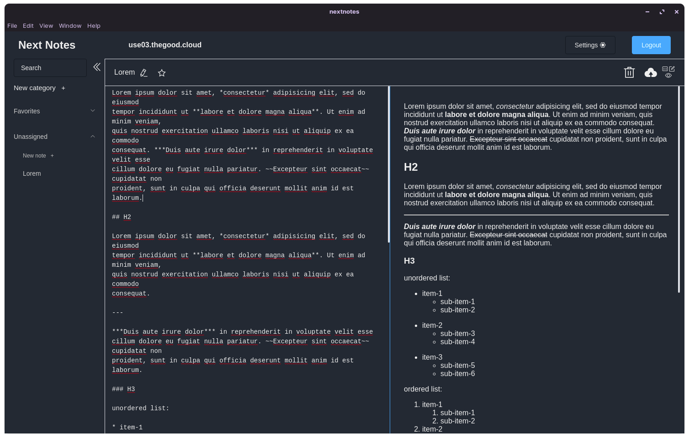

# nextnotes

This app is a desktop interface to manage your nextcloud notes app from your desktop.
I was never a huge fan of nextcloud's default web interface for taking notes, so I created this interface, with a group based side menu, and side to side spli editor / view.

Yes, this is an Electron app.

This is very much a work in progress. As of the latest release there are a few vital features missing:
- Context menu: there is no right-click menu for copy, cut paste yet
- In app data is not yet updated constantly (this may cause huge issues if using the app on another device at the same time)

On top of that, features which should be in the app but will be added in after dealing with the more urgent ones: 
- Encrypted local storage for notes (and user settings). Currently, the app does not have any persistent local storage for the notes. This means that at this stage, the app is just a pretty interface for nextcloud's notes app
- Additional notes information such as last edited date, app info, license etc.

## Screenshots


## Project setup
```
npm install
```

### Compiles and hot-reloads for development
```
npm run electron:serve
```

### Compiles and minifies for production
```
npm run electron-build
```

### Customize configuration
See [Configuration Reference](https://cli.vuejs.org/config/).
