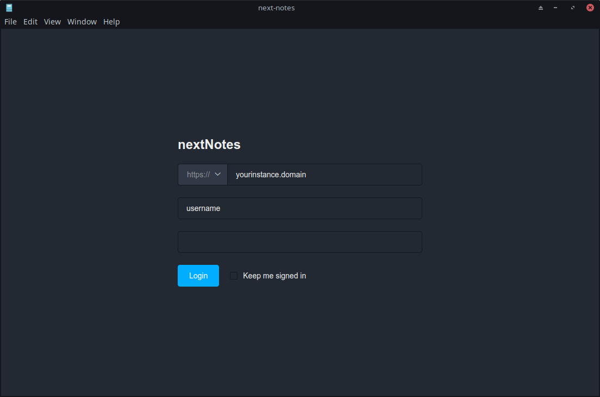
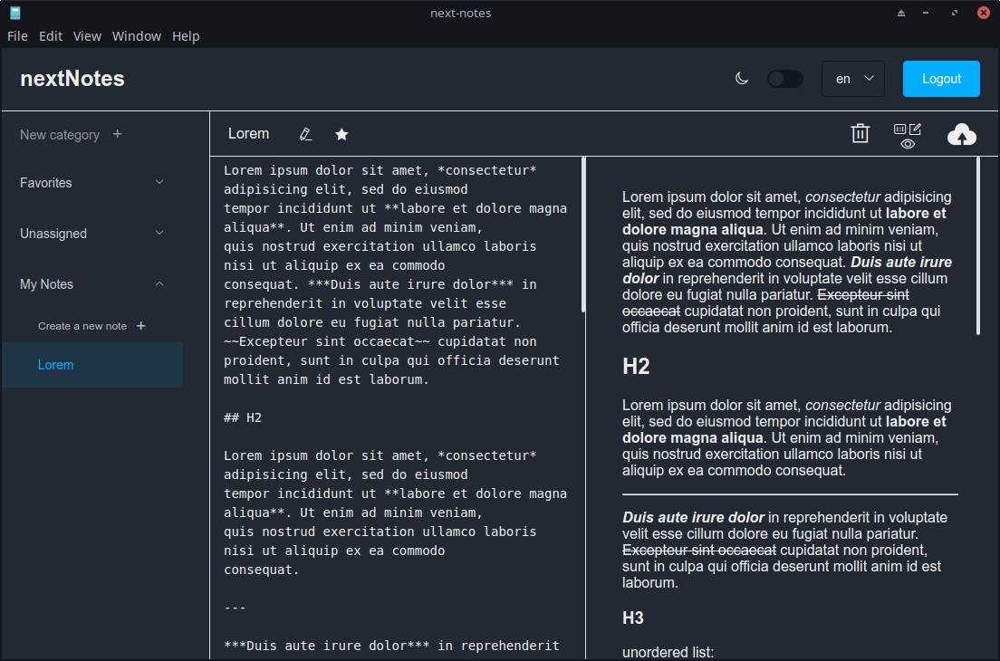
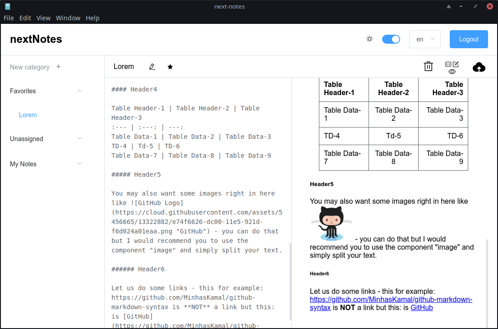

# next-notes

### This is a very early build, do not trust it without backing up your data!

This is an unfinished project, currently on hold.

The codebase is in dire need of a refactor.

---
This is a desktop editor for Nextcloud notes. In it's current state, there is not local storage, so a constant internet connection is required.

Supports folder management, favorite notes, side to side editing + viewing

---
# Screenshots







## Project setup

```
npm install
```

### Compiles and hot-reloads for development
```
npm run start
```

### Build
```
npm run electron:build
```

If your are not on Linux and the app ins't running, in `background.js`, check the `iconPath`, I didn't test how well that works on Windows or Mac.

